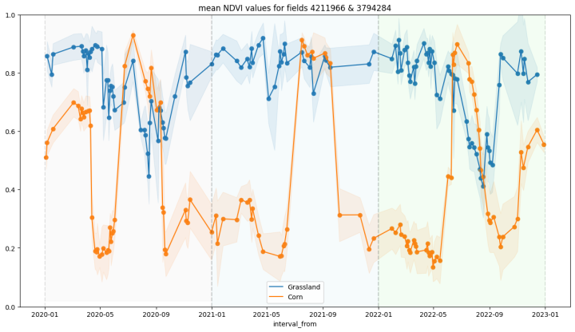

# Project Sentinel statistical API

In this notebook I use the SentinelHub statistical API to gather NDVI data in a 3 year timespan for two agricultural fields in Flanders region.

# Installation
Download the source .TIFF file from [this link](https://www.mediafire.com/view/p5mz28kul0gwldg/response.tiff/file)

- Copy this file to `data/sentinel2/source`

Download the source geodata for agricultural areas in Flanders from [this link](https://www.mediafire.com/file/my7zyicbov9p1hl/Shapefile.7z/file)

- Extract this file into `data/agriculture_geodata`

Create a virtual environment with Python 3.10

Install the necessary libraries with

`pip install -r requirements.txt`

# Usage

- Run the Jupyter notebook `sentinel-stat-ndvi.ipynb` in your favorite IDE.

# Includes

External scripts, classes and functions are located in the `scripts` folder

Outputs from UTM conversion will be saved in the `data/processed` folder

Sentinel requests for specific fields will be saved in the `data/sentinel2/fields` folder

Outputs from the violin-charts will be saved in the `data/export` folder

# Method

1. Obtaining the labels
2. Conversion to UTM31
3. Selecting two fields
4. Obtaining statistical data from Sentinel2
5. Cleaning the data
    - Cloud cover
    - Cloud probability
    - Snow cover
6. Result
7. Violin charts

# Result
We obtain the following chart of the NDVI of the two fields for a 3 years time period.

# Further info

This notebook accompanies my [article on Medium](https://medium.com/@francode77/seasonal-ndvi-charts-with-sentinel-2-86cff663d36)

# Contributors

This notebook was written by Frank Trioen, April 2023.
